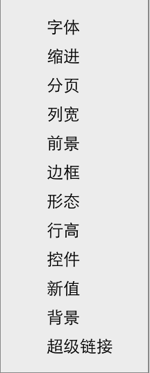
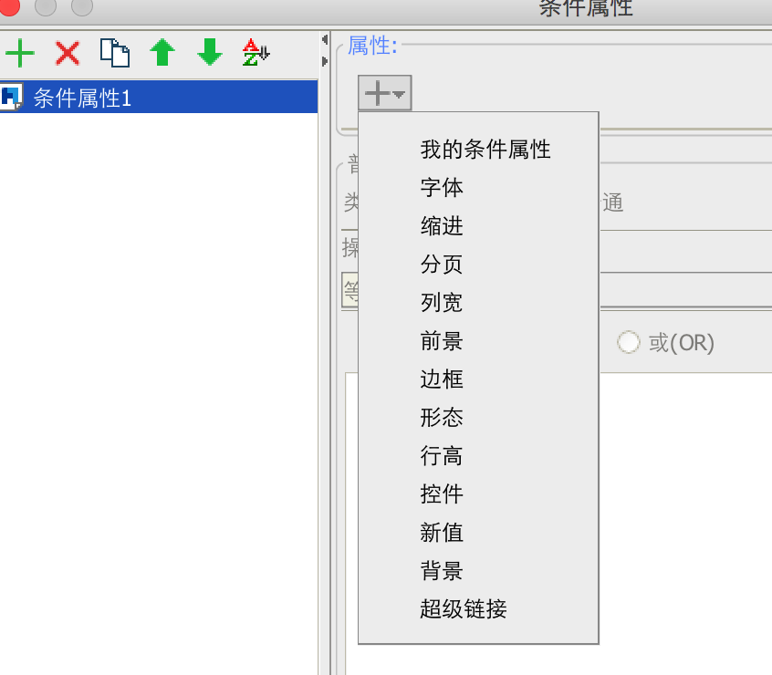
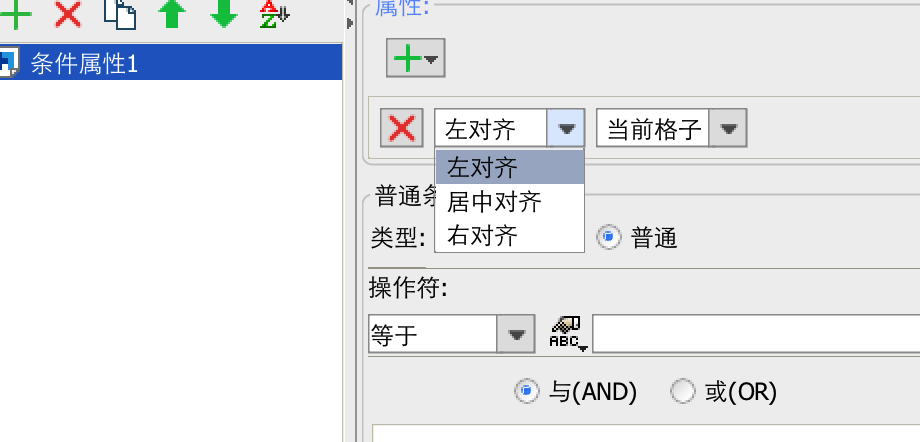

# 自定义条件属性
当前已有的条件属性包含下图中的几种类型



在特殊情况下，已有的几种类型并不能完全满足需求，典型的就是，根据不同的条件把单元格内的内容做不同的对齐。
这个时候，就可以使用条件属性接口```com.fr.design.fun.HighlightProvider```以及其抽象类```com.fr.design.fun.impl.AbstractHighlightProvider```了。
通过这个接口可以制作出如下如所示的插件效果



可以看到多出了一个"我的条件属性"的项，当然这个名字是可以根据实际情况修改的。
选择了以后，就可以设置单元格的对齐方式了


